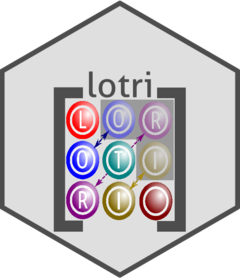

<!--
---
output:
  md_document:
    variant: markdown_github
    toc: true
    toc_depth: 3
---
-->
<!-- README.md is generated from README.Rmd. Please edit that file -->
<!-- https://blog.r-hub.io/2019/12/03/readmes/ -->

```{r, include = FALSE}
knitr::opts_chunk$set(
  collapse = TRUE,
  comment = "#>",
  fig.path = "man/figures/README-",
  out.width = "100%"
)
```

<!-- badges: start -->
[](https://github.com/nlmixr2/lotri/actions)
[](https://app.codecov.io/gh/nlmixr2/lotri)
[](https://cran.r-project.org/package=lotri)
[](https://cran.r-project.org/package=lotri)
[](https://www.codefactor.io/repository/github/nlmixr2/lotri)
[](https://github.com/nlmixr2/lotri/actions/workflows/R-CMD-check.yaml)
<!-- badges: end -->

# lotri 

The goal of lotri is to easily specify block-diagonal matrices with
(lo)wer (tri)angular matrices.  Its as if you have won the (badly
spelled) lotri (or lottery).

This was made to allow people (like me) to specify lower triangular
matrices similar to the domain specific language implemented in
`nlmixr2`.  Originally I had it included in `RxODE`, but thought it may
have more general applicability, so I separated it into a new
package.

## Installation

You can install the released version of lotri from
[CRAN](https://CRAN.R-project.org) with:

``` r
install.packages("lotri")
```

And the development version from [GitHub](https://github.com/) with:

``` r
# install.packages("devtools")
devtools::install_github("nlmixr2/lotri")
```
## Example

This is a basic example for an easier way to specify matrices in R.
For instance to fully specify a simple `2x2` matrix, in R you specify:

```{r}
mat <- matrix(c(1, 0.5, 0.5, 1),nrow=2,ncol=2,dimnames=list(c("a", "b"), c("a", "b")))
```

With `lotri`, you simply specify:

```{r}
library(lotri)
library(microbenchmark)
library(ggplot2)


mat <- lotri(a+b ~ c(1,
                     0.5, 1))
print(mat)

# You can also specify line by line:
mat <- lotri({a ~ 1
              b ~ c(0.5, 1)})
print(mat)
```

I find it more legible and easier to specify, especially if you have a
more complex matrix.  For instance with the more complex matrix:

```{r}
mat <- lotri({
    a+b ~ c(1,
            0.5, 1)
    c ~ 1
    d +e ~ c(1,
             0.5, 1)
})
print(mat)

# or
mat <- lotri({
  a ~ 1
  b ~ c(0.5, 1)
  c ~ 1
  d ~ 1
 e ~ c(0.5, 1)
})

print(mat)
```

To fully specify this in base R you would need to use:

```{r}
mat <- matrix(c(1, 0.5, 0, 0, 0,
                0.5, 1, 0, 0, 0,
                0, 0, 1, 0, 0,
                0, 0, 0, 1, 0.5,
                0, 0, 0, 0.5, 1),
              nrow=5, ncol=5,
              dimnames= list(c("a", "b", "c", "d", "e"),
                             c("a", "b", "c", "d", "e")))
print(mat)
```

Of course with the excellent `Matrix` package this is a bit easier:

```{r}
library(Matrix)
mat <- matrix(c(1, 0.5, 0.5, 1),
              nrow=2,
              ncol=2,
              dimnames=list(c("a", "b"), c("a", "b")))

mat <- bdiag(list(mat, matrix(1), mat))

## Convert back to standard matrix
mat <- as.matrix(mat)
##
dimnames(mat) <- list(c("a", "b", "c", "d", "e"),
                      c("a", "b", "c", "d", "e"))
print(mat)
```

Regardless, I think `lotri` is a bit easier to use.

# Creating lists of matrices with attached properties

`lotri` also allows lists of matrices to be created by conditioning on
an `id` with the `|` syntax.

For example:


```{r}
mat <- lotri({
    a+b ~ c(1,
            0.5, 1) | id
    c ~ 1 | occ
    d + e ~ c(1,
              0.5, 1) | id(lower=3, upper=2, omegaIsChol=FALSE)
})

print(mat)

print(mat$lower)
print(mat$upper)
print(mat$omegaIsChol)
```

This gives a list of matrix(es) conditioned on the variable after the
`|`.  It also can add properties to each list that can be accessible
after the list of matrices is returned, as shown in the above example.
To do this, you simply have to enclose the properties after the
conditional variable.  That is `et1 ~ id(lower=3)`.


## Combining symmetric (named) matrices

Now there is even a faster way to do a similar banded matrix
concatenation with `lotriMat`

```{r}
testList <- list(lotri({et2 + et3 + et4 ~ c(40,
                            0.1, 20,
                            0.1, 0.1, 30)}),
                     lotri(et5 ~ 6),
                     lotri(et1+et6 ~c(0.1, 0.01, 1)),
                     matrix(c(1L, 0L, 0L, 1L), 2, 2,
                            dimnames=list(c("et7", "et8"),
                                          c("et7", "et8"))))

matf <- function(.mats){
  .omega <- as.matrix(Matrix::bdiag(.mats))
  .d <- unlist(lapply(seq_along(.mats),
                      function(x) {
                        dimnames(.mats[[x]])[2]
                      }))
  dimnames(.omega) <- list(.d, .d)
  return(.omega)
}

print(matf(testList))

print(lotriMat(testList))

mb <- microbenchmark(matf(testList),lotriMat(testList))

print(mb)

autoplot(mb)
```

You may also combine named and unnamed matrices, but the resulting
matrix will be unnamed, and still be faster than `Matrix`:

```{r}
testList <- list(lotri({et2 + et3 + et4 ~ c(40,
                            0.1, 20,
                            0.1, 0.1, 30)}),
                     lotri(et5 ~ 6),
                     lotri(et1+et6 ~c(0.1, 0.01, 1)),
                     matrix(c(1L, 0L, 0L, 1L), 2, 2))

matf <- function(.mats){
  .omega <- as.matrix(Matrix::bdiag(.mats))
  return(.omega)
}

print(matf(testList))

print(lotriMat(testList))

mb <- microbenchmark(matf(testList),lotriMat(testList))

print(mb)

autoplot(mb)
```

## New features

A new feature is the ability to condition on variables by `|`.  This
will be useful when simulating nested random effects using the
upcoming `RxODE2`
