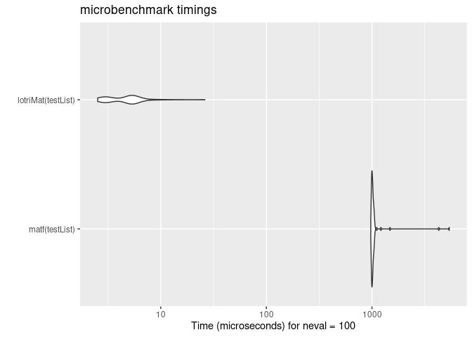

<!-- README.md is generated from README.Rmd. Please edit that file -->


<!-- badges: start -->
[](https://github.com/nlmixrdevelopment/lotri/actions)
[](https://codecov.io/github/nlmixrdevelopment/lotri?branch=master) 
[](https://cran.r-project.org/package=lotri)
[](https://cran.r-project.org/package=lotri)
[](https://www.codefactor.io/repository/github/nlmixrdevelopment/lotri/overview/master)
<!-- badges: end -->

# lotri

The goal of lotri is to easily specify block-diagonal matrices with
(lo)wer (tri)angular matrices.  Its as if you have won the (badly
spelled) lotri (or lottery).

This was made to allow people (like me) to specify lower triangular
matrices similar to the domain specific language implemented in
`nlmixr`.  Originally I had it included in `RxODE`, but thought it may
have more general applicability, so I separated it into a new
package. 

## Installation

You can install the released version of lotri from
[CRAN](https://CRAN.R-project.org) with:

``` r
install.packages("lotri")
```

And the development version from [GitHub](https://github.com/) with:

``` r
# install.packages("devtools")
devtools::install_github("nlmixrdevelopment/lotri")
```
## Example

This is a basic example for an easier way to specify matrices in R.
For instance to fully specify a simple `2x2` matrix, in R you specify:


```r
mat <- matrix(c(1, 0.5, 0.5, 1),nrow=2,ncol=2,dimnames=list(c("a", "b"), c("a", "b")))
```

With `lotri`, you simply specify:


```r
library(lotri)
library(microbenchmark)
library(ggplot2)


mat <- lotri(a+b ~ c(1,
                     0.5, 1))
print(mat)
#>     a   b
#> a 1.0 0.5
#> b 0.5 1.0
```

I find it more legible and easier to specify, especially if you have a
more complex matrix.  For instance with the more complex matrix:


```r
mat <- lotri({
    a+b ~ c(1,
            0.5, 1)
    c ~ 1
    d +e ~ c(1,
             0.5, 1)
})
print(mat)
#>     a   b c   d   e
#> a 1.0 0.5 0 0.0 0.0
#> b 0.5 1.0 0 0.0 0.0
#> c 0.0 0.0 1 0.0 0.0
#> d 0.0 0.0 0 1.0 0.5
#> e 0.0 0.0 0 0.5 1.0
```

To fully specify this in base R you would need to use:


```r
mat <- matrix(c(1, 0.5, 0, 0, 0,
                0.5, 1, 0, 0, 0,
                0, 0, 1, 0, 0,
                0, 0, 0, 1, 0.5,
                0, 0, 0, 0.5, 1),
              nrow=5, ncol=5,
              dimnames= list(c("a", "b", "c", "d", "e"),
                             c("a", "b", "c", "d", "e")))
print(mat)
#>     a   b c   d   e
#> a 1.0 0.5 0 0.0 0.0
#> b 0.5 1.0 0 0.0 0.0
#> c 0.0 0.0 1 0.0 0.0
#> d 0.0 0.0 0 1.0 0.5
#> e 0.0 0.0 0 0.5 1.0
```

Of course with the excellent `Matrix` package this is a bit easier:


```r
library(Matrix)
mat <- matrix(c(1, 0.5, 0.5, 1),
              nrow=2,
              ncol=2,
              dimnames=list(c("a", "b"), c("a", "b")))

mat <- bdiag(list(mat, matrix(1), mat))

## Convert back to standard matrix
mat <- as.matrix(mat)
##
dimnames(mat) <- list(c("a", "b", "c", "d", "e"),
                      c("a", "b", "c", "d", "e"))
print(mat)
#>     a   b c   d   e
#> a 1.0 0.5 0 0.0 0.0
#> b 0.5 1.0 0 0.0 0.0
#> c 0.0 0.0 1 0.0 0.0
#> d 0.0 0.0 0 1.0 0.5
#> e 0.0 0.0 0 0.5 1.0
```

Regardless, I think `lotri` is a bit easier to use.

# Creating lists of matricies with attached properties

`lotri` also allows lists of matrices to be created by conditioning on
an `id` with the `|` syntax.

For example:


```r
mat <- lotri({
    a+b ~ c(1,
            0.5, 1) | id
    c ~ 1 | occ
    d + e ~ c(1,
              0.5, 1) | id(lower=3, upper=2, omegaIsChol=FALSE)
})

print(mat)
#> $id
#>     d   e
#> d 1.0 0.5
#> e 0.5 1.0
#> 
#> $occ
#>   c
#> c 1
#> 
#> Properties: lower, upper, omegaIsChol

print(mat$lower)
#> $id
#> d e 
#> 3 3 
#> 
#> $occ
#>    c 
#> -Inf
print(mat$upper)
#> $id
#> d e 
#> 2 2 
#> 
#> $occ
#>   c 
#> Inf
print(mat$omegaIsChol)
#> $id
#> [1] FALSE
```

This gives a list of matrix(es) conditioned on the variable after the
`|`.  It also can add properties to each list that can be accessible
after the list of matrices is returned, as shown in the above example.
To do this, you simply have to enclose the properties after the
conditional variable.  That is `et1 ~ id(lower=3)`.


## Combining symmetric named matrices

Now there is even a faster way to do a similar banded matrix
concatenation with `lotriMat`


```r
testList <- list(lotri({et2 + et3 + et4 ~ c(40,
                            0.1, 20,
                            0.1, 0.1, 30)}),
                     lotri(et5 ~ 6),
                     lotri(et1+et6 ~c(0.1, 0.01, 1)),
                     matrix(c(1L, 0L, 0L, 1L), 2, 2,
                            dimnames=list(c("et7", "et8"),
                                          c("et7", "et8"))))

matf <- function(.mats){
  .omega <- as.matrix(Matrix::bdiag(.mats))
  .d <- unlist(lapply(seq_along(.mats),
                      function(x) {
                        dimnames(.mats[[x]])[2]
                      }))
  dimnames(.omega) <- list(.d, .d)
  return(.omega)
}

print(matf(testList))
#>      et2  et3  et4 et5  et1  et6 et7 et8
#> et2 40.0  0.1  0.1   0 0.00 0.00   0   0
#> et3  0.1 20.0  0.1   0 0.00 0.00   0   0
#> et4  0.1  0.1 30.0   0 0.00 0.00   0   0
#> et5  0.0  0.0  0.0   6 0.00 0.00   0   0
#> et1  0.0  0.0  0.0   0 0.10 0.01   0   0
#> et6  0.0  0.0  0.0   0 0.01 1.00   0   0
#> et7  0.0  0.0  0.0   0 0.00 0.00   1   0
#> et8  0.0  0.0  0.0   0 0.00 0.00   0   1

print(lotriMat(testList))
#>      et2  et3  et4 et5  et1  et6 et7 et8
#> et2 40.0  0.1  0.1   0 0.00 0.00   0   0
#> et3  0.1 20.0  0.1   0 0.00 0.00   0   0
#> et4  0.1  0.1 30.0   0 0.00 0.00   0   0
#> et5  0.0  0.0  0.0   6 0.00 0.00   0   0
#> et1  0.0  0.0  0.0   0 0.10 0.01   0   0
#> et6  0.0  0.0  0.0   0 0.01 1.00   0   0
#> et7  0.0  0.0  0.0   0 0.00 0.00   1   0
#> et8  0.0  0.0  0.0   0 0.00 0.00   0   1

mb <- microbenchmark(matf(testList),lotriMat(testList))

print(mb)
#> Unit: microseconds
#>                expr     min       lq      mean   median       uq      max neval
#>      matf(testList) 464.486 470.1440 554.46817 474.5055 519.6730 6347.862   100
#>  lotriMat(testList)   1.109   1.4095   2.59312   1.9420   2.5075   59.198   100

autoplot(mb)
#> Coordinate system already present. Adding new coordinate system, which will replace the existing one.
```



## New features

A new feature is the ability to condition on variables by `|`.  This
will be useful when simulating nested random effects using the
upcoming `RxODE`

